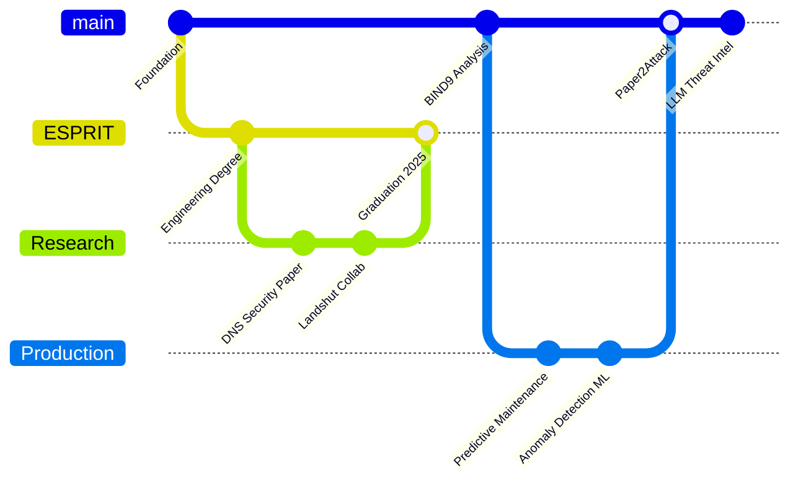
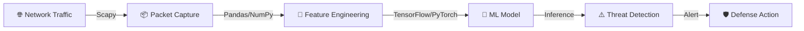

```text
▓▓▓▓▓▓▓▓▓▓▓▓▓▓▓▓▓▓▓▓▓▓▓▓▓▓▓▓▓▓▓▓▓▓▓▓▓▓▓▓▓▓▓▓▓▓▓▓▓▓▓▓▓▓▓▓▓▓▓▓▓▓▓▓▓▓▓▓▓▓▓▓
▓▓                                                                      ▓▓
▓▓              🔷  D H I A   E L   H A K   R A C H E D  🔷           ▓▓
▓▓                                                                      ▓▓
▓▓           ░▒▓▓▓  AI  &  CYBERSECURITY  ENGINEER  ▓▓▓▒░              ▓▓
▓▓                                                                      ▓▓
▓▓▓▓▓▓▓▓▓▓▓▓▓▓▓▓▓▓▓▓▓▓▓▓▓▓▓▓▓▓▓▓▓▓▓▓▓▓▓▓▓▓▓▓▓▓▓▓▓▓▓▓▓▓▓▓▓▓▓▓▓▓▓▓▓▓▓▓▓▓▓▓
```

[](mailto:racheddhiaelhakk@gmail.com)
[](https://www.linkedin.com/in/dhiaelhak-rached/)
[](https://github.com/Dhiaelhak-Rached)

---

```text
╔════════════════════════════════════════════╗
║  🟢 SYSTEM STATUS: OPERATIONAL              ║
║  🎯 ACTIVE FOCUS: DNS Anomaly Detection     ║
║  📍 LOCATIONS: Tunisia  ·  Germany          ║
║  🔐 CLEARANCE: Threat Intelligence Architect ║
╚════════════════════════════════════════════╝
```

> [!IMPORTANT]
> Research is only valuable when it ships. I optimize for deployable, high-impact systems that survive real-world traffic.

### 🧠 Operator Profile

I engineer intelligent systems that protect networks. My work lives at the intersection of machine learning and infrastructure security.

- 🎓 Engineering Graduate, ESPRIT Tunisia (2025)
- 🔬 Research collaboration with Landshut University (Germany) & Dräxlmaier
- 🛡️ Core domains: DNS Security · AI Threat Detection · Distributed Protocols
- 🔭 Currently architecting next-gen DNS anomaly detection pipelines
- 🌱 Exploring LLM-based threat intelligence & adversarial ML

### 🕰️ Deployment Timeline



### 🏗️ Network Defense Architecture



### 🛠️ Core Competencies

```text
Python      ████████████████████████████████████████░░  95%
C / C++     ██████████████████████████████░░░░░░░░░░░░  75%
TensorFlow  ███████████████████████████████████░░░░░░░  85%
PyTorch     ████████████████████████████████░░░░░░░░░░  80%
Scapy       ████████████████████████████████████░░░░░░  88%
Wireshark   ██████████████████████████████████░░░░░░░░  85%
Docker      ███████████████████████████████░░░░░░░░░░░  78%
Kubernetes  ████████████████████████████░░░░░░░░░░░░░░  72%
```

### 🚀 Mission Log

| Status | Mission                  | Objective                                                                   | Arsenal                     |
|--------|---------------------------|------------------------------------------------------------------------------|------------------------------|
| 🟢     | DNS Anomaly Detection    | ML-driven detection of DNS tunneling, cache poisoning, and resolver abuse    | Python, TensorFlow, Scapy   |
| 🟢     | BIND9 Security Analysis  | Reverse engineering & custom DNS integrity protocol proposal                 | C, DNSSEC, Linux            |
| 🟢     | Predictive Maintenance   | Real-time failure prediction on streaming sensor data                       | PyTorch, Pandas, Docker     |
| 🟡     | Paper2Attack Framework   | Auto-extracts attack parameters from papers and simulates via Scapy         | Python, Scapy, n8n          |

### 📊 Telemetry


### 📡 Contact

- Email: [racheddhiaelhakk@gmail.com](mailto:racheddhiaelhakk@gmail.com)
- LinkedIn: [linkedin.com/in/dhiaelhak-rached](https://www.linkedin.com/in/dhiaelhak-rached/)

```text
▓▓▓▓▓▓▓▓▓▓▓▓▓▓▓▓▓▓▓▓▓▓▓▓▓▓▓▓▓▓▓▓▓▓▓▓▓▓▓▓▓▓▓▓▓▓▓▓▓▓▓▓▓▓▓▓▓▓▓▓▓▓▓▓▓▓▓▓▓▓▓▓
▓▓                                                                      ▓▓
▓▓     © 2025  D H I A   E L   H A K   R A C H E D                     ▓▓
▓▓     AI, Security, and Scalable Intelligence Systems                  ▓▓
▓▓                                                                      ▓▓
▓▓▓▓▓▓▓▓▓▓▓▓▓▓▓▓▓▓▓▓▓▓▓▓▓▓▓▓▓▓▓▓▓▓▓▓▓▓▓▓▓▓▓▓▓▓▓▓▓▓▓▓▓▓▓▓▓▓▓▓▓▓▓▓▓▓▓▓▓▓▓▓
```
